# LuxeMarket — _Minimalist Luxury, Vibe-Coded for fun_

**LuxeMarket** is a premium e-commerce ecosystem with built-in marketing analytics designed to prove that high-end aesthetics and high-performance engineering can coexist through the power of **vibe-coding**. Inspired by the **Japandi** design movement, this platform strips away the digital noise of traditional retail to offer a quiet, functional, and deeply immersive shopping experience.

This project serves as a masterclass in modern, AI-augmented development. The entire platform—from the relational database schema to the custom-handcrafted CSS—was **fully coded in just 2-3 days**.

---

## **The Vibe Coding Manifesto**

In an age of over-documentation and rigid, slow boilerplate, LuxeMarket was built by following the "flow." Leveraging a sophisticated agentic toolset including **Google Antigravity**, **Stitch MCP**, **GitHub Copilot**, **Claude**, and **Gemini**, every line of code was written to serve the "vibe"—if it didn't feel premium, it didn't make the cut.

This is rapid development at the speed of thought.

---

## Tech Stack

| Layer      | Technology                                 |
| ---------- | ------------------------------------------ |
| Frontend   | React 19 + TypeScript + Vite               |
| Styling    | Custom CSS (Japandi tokens) + Tailwind CSS |
| Routing    | react-router-dom v6                        |
| Backend    | Python 3.12 + FastAPI                      |
| Database   | PostgreSQL 16                              |
| ORM        | SQLAlchemy 2 + Alembic                     |
| Auth       | JWT (python-jose + passlib/bcrypt)         |
| Containers | Docker + Docker Compose                    |

---

## Project Structure

```
luxemarket/
├── frontend/                   # React 19 + TypeScript + Vite
│   ├── src/
│   │   ├── pages/              # 10 screens
│   │   │   ├── Storefront/
│   │   │   ├── ProductDetail/
│   │   │   ├── Cart/
│   │   │   ├── Checkout/
│   │   │   ├── OrderConfirmation/
│   │   │   ├── TrackOrder/
│   │   │   ├── Login/
│   │   │   ├── AdminDashboard/
│   │   │   ├── AdminManagement/
│   │   │   └── MarketingAnalytics/
│   │   ├── components/
│   │   │   ├── layout/         # Navbar, Footer
│   │   │   └── admin/          # AdminSidebar
│   │   ├── context/            # AuthContext, CartContext
│   │   ├── services/           # api.ts (Axios client)
│   │   ├── types/              # TypeScript interfaces
│   │   ├── router/             # Route definitions
│   │   └── styles/             # globals.css (Japandi tokens)
│   ├── Dockerfile
│   ├── package.json
│   ├── vite.config.ts
│   └── tailwind.config.ts
│
├── backend/                    # Python 3.12 + FastAPI
│   ├── app/
│   │   ├── api/v1/             # Route handlers
│   │   │   ├── auth.py
│   │   │   ├── products.py
│   │   │   ├── orders.py
│   │   │   ├── cart.py
│   │   │   ├── users.py
│   │   │   └── analytics.py
│   │   ├── core/               # Config, security, dependencies
│   │   ├── db/                 # Engine + session
│   │   ├── models/             # SQLAlchemy ORM models
│   │   ├── schemas/            # Pydantic schemas
│   │   ├── services/           # Business logic layer
│   │   └── main.py             # FastAPI app entry point
│   ├── alembic/                # DB migrations
│   ├── Dockerfile
│   ├── requirements.txt
│   └── .env
│
├── docker-compose.yml
├── .gitignore
└── README.md
```

---

## **Key Features**

### **1. The Zen Storefront**

A masterclass in minimalist discovery. The storefront utilizes a URL-driven search and category system that ensures state is preserved and easily shareable.

- **Intuitive Discovery**: Filter by category (Furniture, Lighting, Decor) or use the global search to find specific pieces.
- **Smart Indicators**: Real-time visual cues for low-stock items ("Only X left") and sold-out products.
- **AIDA Funnel Tracking**: Every interaction is tracked through a custom `useAnalytics` hook, feeding the "Interest" and "Desire" stages of the marketing funnel.

======== Home page ========
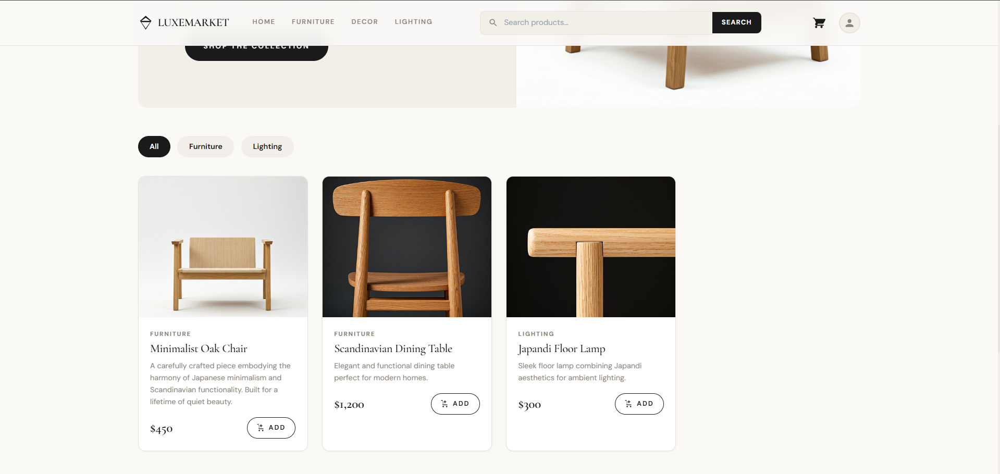

### **2. High-Fidelity Product Detail**

Optimized for conversion and clarity, the product detail pages provide a tactile feel to digital assets.

- **Dynamic Gallery**: Smooth transitions between multiple high-resolution product views.
- **Logistics Transparency**: Clear messaging on white-glove delivery and stock availability.
- **Contextual Recommendations**: A "You May Also Like" engine that intelligently prioritizes same-category items to drive higher AOV.

======== Product details ========
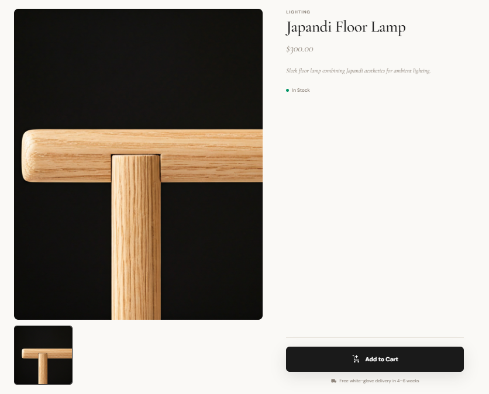

### **3. Precision Checkout & Order Tracking**

A distraction-free multi-step checkout flow that prioritizes data integrity and user confidence.

- **Validated Logistics**: Full state binding for shipping information (First/Last name, Address, City, Zip).
- **Flexible Delivery**: Choice between standard and white-glove assembly services.
- **Visual Timeline**: A dedicated order tracking page featuring a visual progress bar for the order lifecycle (Pending → Processing → Shipped → Delivered).

======== SignUp before order ========
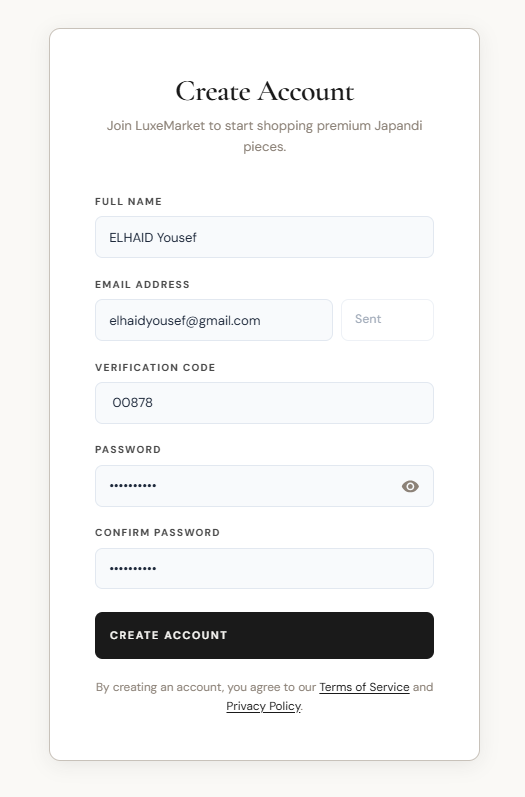

======== Cart ========
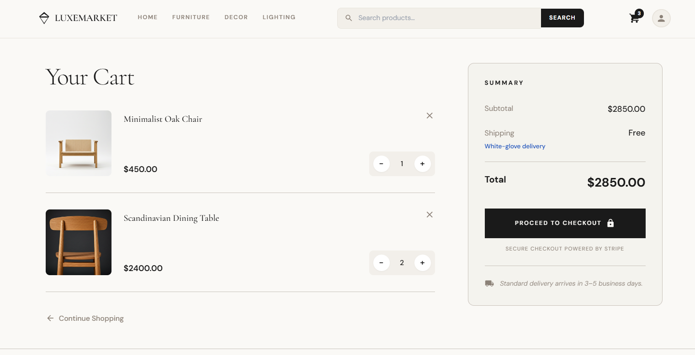

======== Validate user and payment information ========
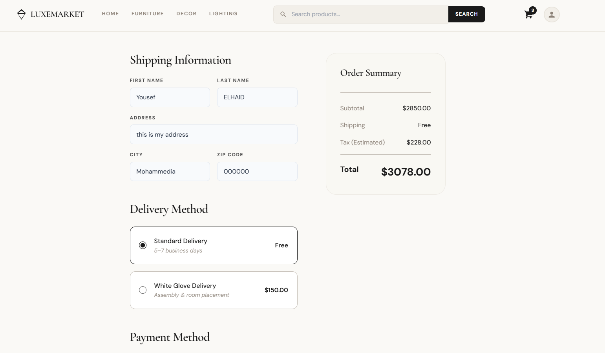

======== Order confirmed with ID to track it ========
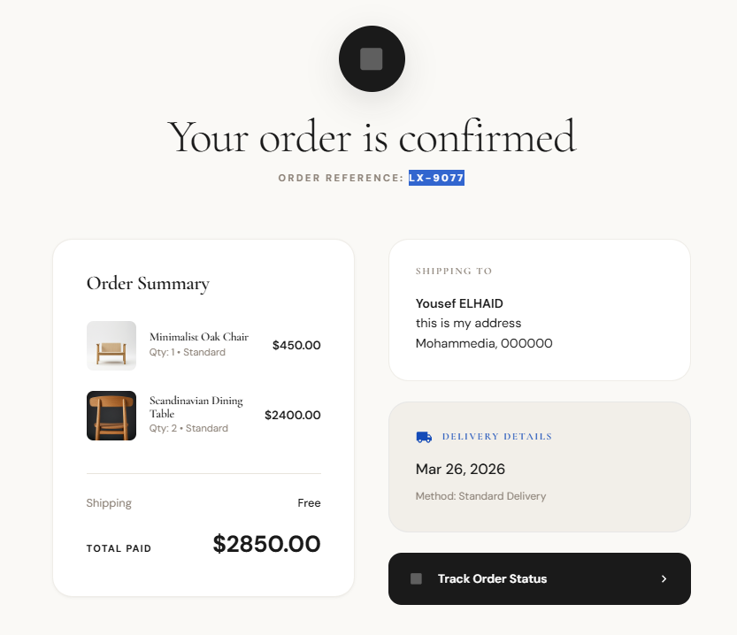

======== Track order with ID ========
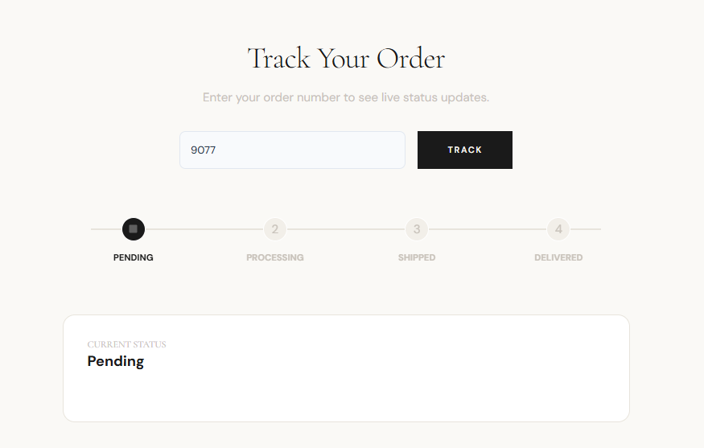

### **4. Admin Command Center**

A robust, secure suite designed for business orchestration.

- **Marketing Analytics**: Visualized peak shopping hours through an hourly activity heatmap, allowing admins to optimize ad spend.
- **Inventory Orchestration**: Full CRUD capabilities for the product catalog with an integrated image upload service.
- **Team Management**: A high-security portal for Super Admins to manage roles (Super Admin, Editor) and account statuses.

======== Admin dashboard ========
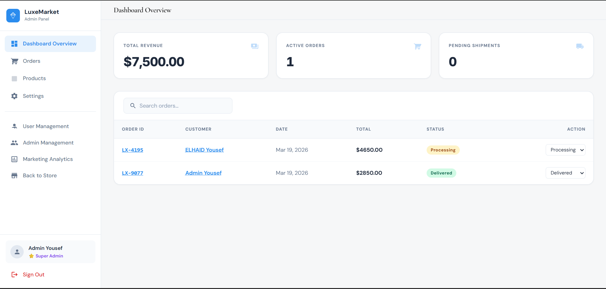

======== Table of products ========
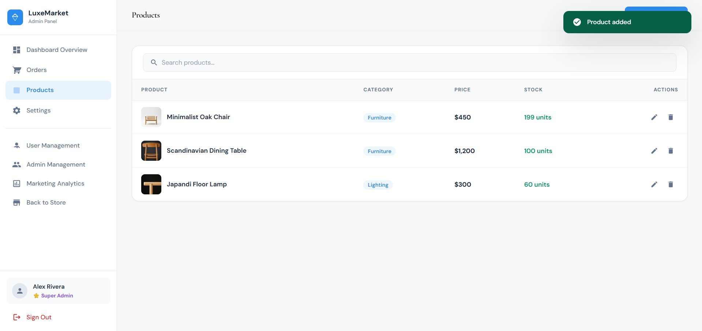

======== Add new product ========
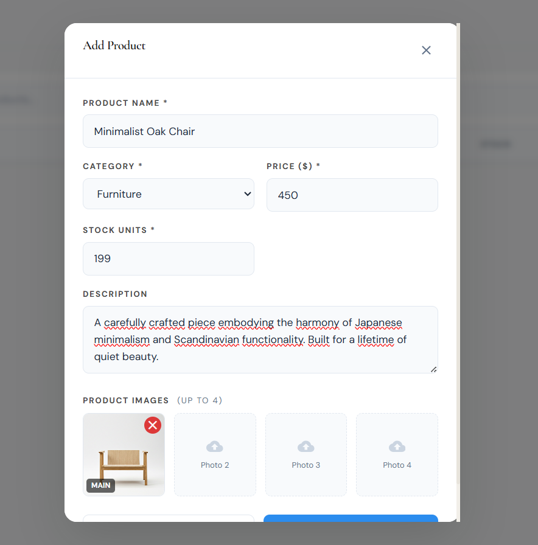

======== Manage admin profil ========
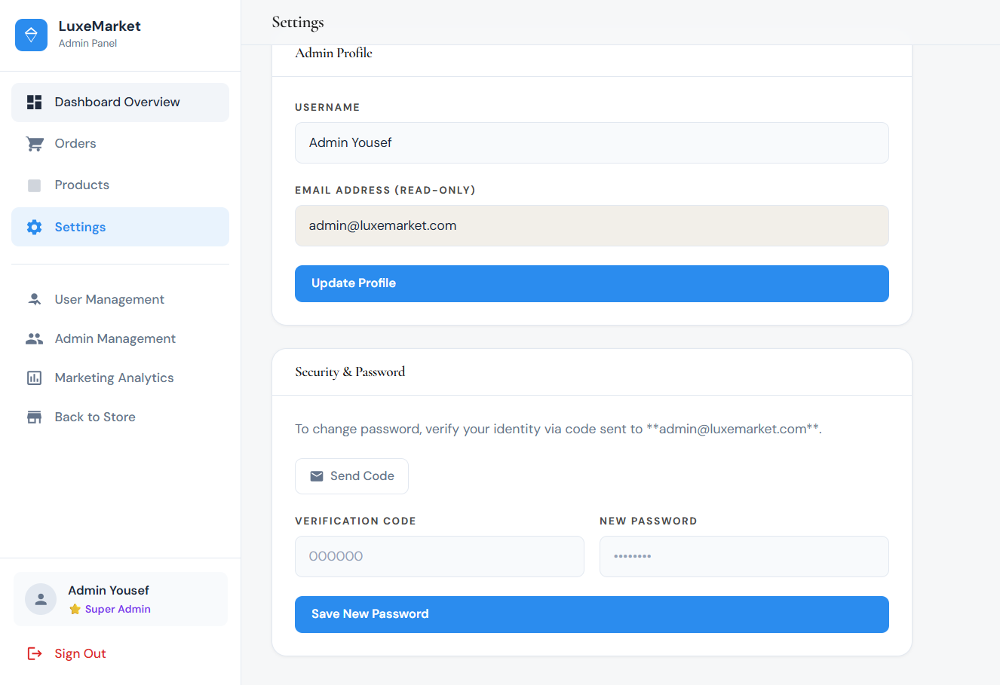

======== Table of users ========
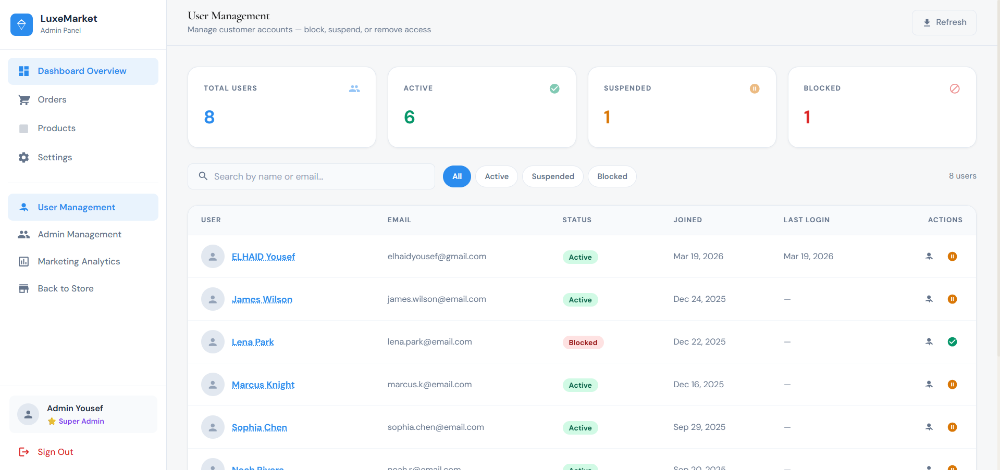

======== Table of admins ========
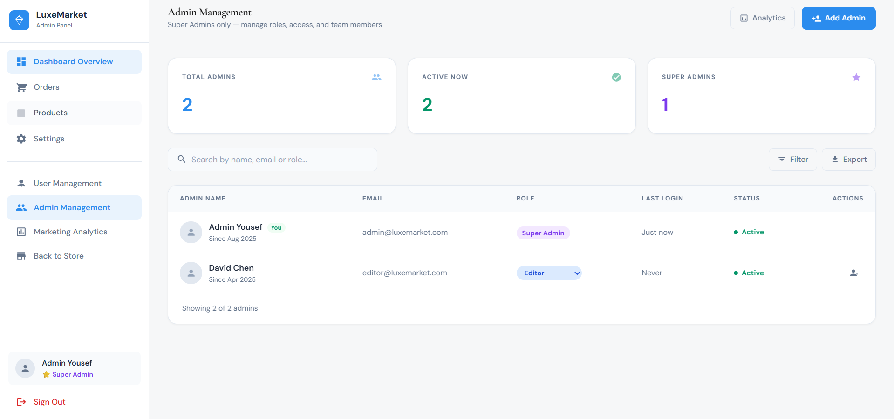

======== Marketing Analytics ========
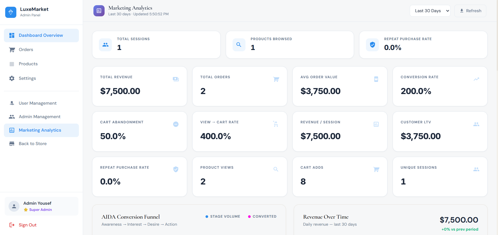

======== Marketing Analytics ========
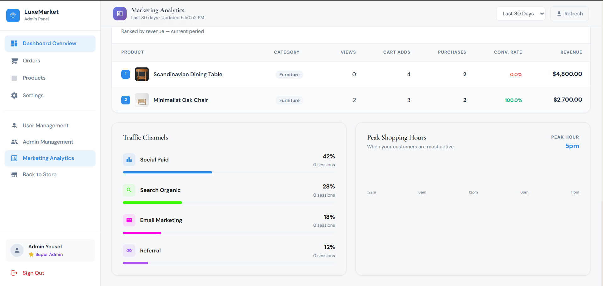

---

## **Ironclad Security**

LuxeMarket employs a zero-trust security model for both customers and staff:

- **Bot Prevention**: Mandatory 6-digit email verification for new account registrations via SMTP integration.
- **Secure Logistics**: Identity-verified logistics and password recovery flows.
- **Role-Based Access (RBAC)**: Backend dependencies (`get_current_super_admin`) strictly enforce data silos.

---

## **The Tech Stack**

### **The Backend (Power & Precision)**

- **FastAPI**: Asynchronous Python framework for high-performance API delivery.
- **SQLAlchemy**: Robust ORM managing complex relations between Users, Orders, and Events.
- **Pydantic V2**: Strict data validation for all incoming and outgoing payloads.

### **The Frontend (Flow & Aesthetics)**

- **React + Vite**: Optimized for speed and modern developer experience.
- **Custom Japandi UI**: Handcrafted CSS utilizing a custom "Airy" spacing scale and neutral palettes.
- **jsPDF & html2canvas**: High-fidelity, client-side PDF generation for professional order receipts.

### **Infrastructure**

- **Docker & Docker Compose**: Fully containerized for one-command deployment across any environment.

---

## **Infrastructure Architecture**

The project is architected for scalability within a containerized environment:

- **`backend/`**: Python 3.11 environment with persistent media storage.
- **`frontend/`**: Node/Vite environment optimized for static asset delivery.
- **PostgreSQL**: The relational backbone for all transactional and analytical data.

---

## Quick Start

### Option 1 — Docker Compose (recommended)

```bash
# Clone and enter the project
git clone https://github.com/elhaidyousef/luxe-market.git
cd luxemarket

# Start all three containers
docker compose up --build

# App URLs:
#   Frontend  → http://localhost:5173
#   Backend   → http://localhost:8000
#   API Docs  → http://localhost:8000/api/docs
```

### Option 2 — Local development

**Backend**

```bash
cd backend

# Create virtual environment
python -m venv .venv
source .venv/bin/activate      # Windows: .venv\Scripts\activate

# Install dependencies
pip install -r requirements.txt

# Set up PostgreSQL and update .env with your DATABASE_URL

# Run migrations
alembic upgrade head

# Start dev server
uvicorn app.main:app --reload --port 8000
```

**Frontend**

```bash
cd frontend

npm install
npm run dev
# → http://localhost:5173
```

---

## Demo Credentials

| Role                  | Email                   | Password    |
| --------------------- | ----------------------- | ----------- |
| Super Admin(Owner)    | `admin@luxemarket.com`  | `admin123`  |
| Admin(Editor)         | `editor@luxemarket.com` | `editor123` |
| Customer(Normal user) | `user@luxemarket.com`   | `user123`   |

> These are mocked in the frontend `AuthContext`. To enable real authentication, wire the login form to `POST /api/v1/auth/login` and seed the database with these users.

---

## API Reference

Full interactive docs available at **`http://localhost:8000/api/docs`** (Swagger UI).

_LuxeMarket — Built by Yousef ELHAID (Kira). Developed with speed, delivered with soul._ 💎
